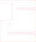
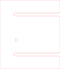

# Garmin GNS 430

The Garmin GNS 430 is no longer in production but it continues to be ubiquitous in general aviation. This GPS is specifically designed for use with X-Plane 11.10 (or greater) and uses the [screen-only popup instrument window](https://developer.x-plane.com/2017/09/three-lesser-known-aircraft-features-for-11-10/) feature in X-Plane to render the GPS screen on an HDMI display that is integrated into the assembly.

## Parts List

| Component                                | Part                                     | Quantity  | Source                                   |
| ---------------------------------------- | ---------------------------------------- | --------- | ---------------------------------------- |
| Faceplate, hardware mount, mounting brackets | 3/16" bright white cast acrylic          | 441x69 mm | http://ebay.to/2Bn1CMs                   |
| Display                                  | Waveshare 4inch HDMI LCD Resistive Touch Screen 800x480 | 1         | http://amzn.to/2CdkoJP                   |
| Knobs                                    | 8mm Dual Rotary Encoder Switch w/Knobs & Mounting PCB | 2         | http://www.desktopaviator.com/Products/parts.htm |
| Push Buttons                             | 7mmx7mm Momentary DPDT Mini Push Button Switch | 13        | http://amzn.to/2BWXQc5                   |
| Power/volume                             | 20K Ohm Dual Linear Taper Potentiometer Switch | 2         | http://amzn.to/2Cr6Asi                   |
| Screws (for attaching hardware mount to the faceplate) | \#6-32 x 1/2" Phillips Pan Head Screws   | 4         | http://amzn.to/2DC4JzY                   |
| Screws (for attaching frame mounts to mounting brackets) | \#4 x 1/2" Flat Head Sheet Metal Screws  | 4         |                                          |

## Faceplate

The faceplate is laser cut from white acrylic, painted black, and then laser engraved.

`faceplate.svg`

## Hardware Mount

The hardware mount provides a layer for mounting the push-buttons and the display. I used acrylic for mounting the push buttons to simplify construction and to avoid having to create a circuit board. The push buttons are glued into the hardware mount.

`hardware_mount.svg`

## Frame Mounts

The frame mounts are used to attach the assembly to the [frame](../../frame).

`frame_mount_left.svg`

`frame_mount_right.svg`

## Frame Mount Brackets

The frame mounts are attached to the hardware mount with these brackets and \#4 x 1/2" flat head screws.

`frame_mount_bracket.stl` (https://www.thingiverse.com/thing:2723972)

### Display Mounting Clips

The display mounting clips secure the display to the hardware mount and to the faceplate. A shallow 1/8" hole is drilled into the rear of the faceplate. The clips are designed to work with \#6-32 x 1/2 pan head screws.

`display_clip.stl` (https://www.thingiverse.com/thing:2723972)

### Display Bezel

A 3d printed display bezel is sandwiched between the layers to compensate for the difference in thickness between the display and the hardware mount panel. The bezel also provides a clean finish and is similar to the bezel profile on a real GNS 430.

`display_bezel.stl` (https://www.thingiverse.com/thing:2723972)

## Buttons

The GPS buttons are 3d-printed from white PLA, painted, and laser-engraved.

#### Small Buttons

#### Medium Buttons

### Zoom Button

#### Flip Flop Buttons

## Knobs

### Dual-Rotary Knobs

The knobs for the dual concentric rotary encoders are designed to match those found on a real GNS 430 and are 3d printed from white PLA, painted, and laser-engraved.

`knob_inner.stl` (https://www.thingiverse.com/thing:2723972)

`knob_outer.stl` (https://www.thingiverse.com/thing:2723972)

`knob_engrave.svg`

### Volume Knobs

The knob are 3d printed from white PLA, painted, and laser-engraved.

`volume_knob.stl` (https://www.thingiverse.com/thing:2723972)

`knob_volume_engrave.svg`

